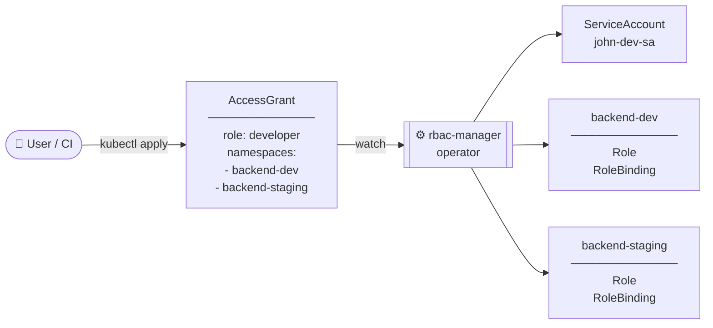
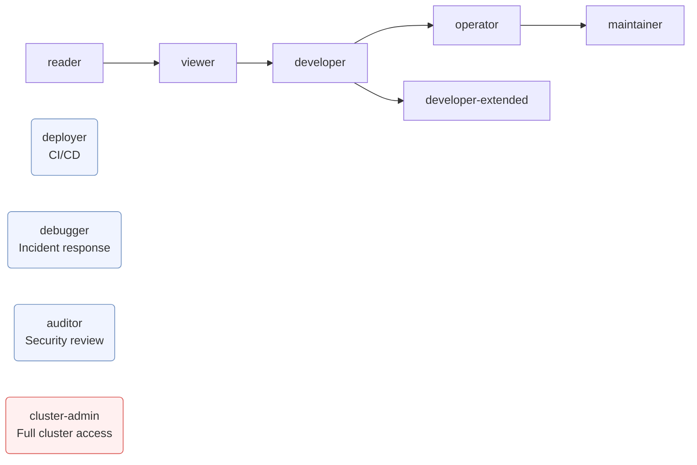

<div align="center">


<br/>

[](https://github.com/xbrekz1/rbac-manager/actions/workflows/ci.yml)
[](https://github.com/xbrekz1/rbac-manager/actions/workflows/release.yml)
[](https://goreportcard.com/report/github.com/xbrekz1/rbac-manager)
[](LICENSE)

</div>

---

Instead of manually creating ServiceAccounts, Roles, and RoleBindings across namespaces — you declare one `AccessGrant`. The operator handles the rest.

```yaml
apiVersion: rbacmanager.io/v1alpha1
kind: AccessGrant
metadata:
  name: john-developer
  namespace: rbac-manager
spec:
  role: developer
  namespaces: [backend-dev, backend-staging]
  serviceAccountName: john-dev-sa
```

```
$ kubectl get accessgrants -n rbac-manager
NAME             ROLE        SERVICEACCOUNT   NAMESPACES                        PHASE    AGE
john-developer   developer   john-dev-sa      [backend-dev backend-staging]     Active   5s
```

---

## How it works



When the `AccessGrant` is deleted, the operator removes **all** created resources via Kubernetes finalizers — even if it was temporarily down during deletion.

---

## Role hierarchy



| Role | Logs | Exec | Secrets | Write | Use case |
|------|:----:|:----:|:-------:|:-----:|----------|
| `reader` | — | — | — | — | Stakeholders, dashboards |
| `viewer` | ✓ | — | — | — | Monitoring, on-call |
| `developer` | ✓ | ✓ | read | — | Developers, QA |
| `developer-extended` | ✓ | ✓ | read | — | Same + namespace listing for [OpenLens](https://github.com/MuhammedKalkan/OpenLens) |
| `deployer` | ✓ | — | — | ✓ | CI/CD pipelines |
| `debugger` | ✓ | ✓ | — | — | Incident response, port-forward |
| `operator` | ✓ | ✓ | read | ✓ | SRE teams |
| `auditor` | ✓ | — | read | — | Security reviews |
| `maintainer` | ✓ | ✓ | ✓ | ✓ | Tech leads, service owners |
| `cluster-admin` | ✓ | ✓ | ✓ | ✓ | Full cluster access — use with `clusterWide: true` |

---

## Features

- **Event-driven** — reacts to changes instantly via Kubernetes watch, no polling
- **Finalizer-based cleanup** — all RBAC resources are deleted when AccessGrant is removed
- **Self-healing** — periodically reconciles to restore resources deleted externally
- **Namespace watcher** — automatically reconciles when target namespaces are created
- **10 predefined roles** — covering common access patterns out of the box
- **Custom rules** — full `PolicyRule` support when predefined roles aren't enough
- **Validating webhook** — enforces correctness at admission time
- **Rich status** — Conditions, events, and detailed phase tracking
- **Owner references** — automatic garbage collection via Kubernetes
- **ClusterWide mode** — one flag to switch from namespace-scoped to cluster-scoped
- **HA ready** — leader election for multi-replica deployments
- **Minimal image** — distroless base, non-root, read-only filesystem, multi-arch (`amd64` + `arm64`)
- **Comprehensive tests** — unit and integration tests with >80% coverage

---

## Installation

### Operator

**Requirements:** Kubernetes 1.28+, Helm 3.x

```bash
helm install rbac-manager oci://ghcr.io/xbrekz1/charts/rbac-manager \
  --namespace rbac-manager \
  --create-namespace \
  --wait
```

<details>
<summary>Install from source</summary>

```bash
git clone https://github.com/xbrekz1/rbac-manager && cd rbac-manager
helm install rbac-manager . --namespace rbac-manager --create-namespace --wait
```

</details>

### kubeconfigctl CLI

```bash
brew install xbrekz1/rbac-manager/kubeconfigctl
```

Pre-built binaries for Linux and Windows are on the [Releases page](https://github.com/xbrekz1/rbac-manager/releases).
See [docs/KUBECONFIG_GENERATION.md](docs/KUBECONFIG_GENERATION.md) for full usage.

---

## Usage

### Grant access

```bash
kubectl apply -f - <<EOF
apiVersion: rbacmanager.io/v1alpha1
kind: AccessGrant
metadata:
  name: alice
  namespace: rbac-manager
spec:
  role: developer
  namespaces: [backend-dev, backend-staging]
  serviceAccountName: alice-sa
EOF
```

### Grant cluster-wide access

```bash
kubectl apply -f - <<EOF
apiVersion: rbacmanager.io/v1alpha1
kind: AccessGrant
metadata:
  name: platform-bot
  namespace: rbac-manager
spec:
  role: cluster-admin
  clusterWide: true
  serviceAccountName: platform-bot-sa
EOF
```

### Generate kubeconfig

```bash
kubeconfigctl generate alice
# ~/Downloads/kubeconfig-alice.yaml
```

See [docs/KUBECONFIG_GENERATION.md](docs/KUBECONFIG_GENERATION.md) for the full guide.

### Revoke access

```bash
kubectl delete accessgrant alice -n rbac-manager
# ServiceAccount, Roles, RoleBindings — all deleted immediately
```

---

## AccessGrant spec

```yaml
spec:
  # Predefined role (mutually exclusive with customRules)
  role: developer

  # Custom RBAC rules
  # customRules:
  #   - apiGroups: [""]
  #     resources: ["pods"]
  #     verbs: ["get", "list", "watch"]

  # Target namespaces (ignored when clusterWide: true)
  namespaces:
    - my-namespace

  # Create ClusterRole + ClusterRoleBinding instead of namespace-scoped resources
  clusterWide: false

  # ServiceAccount name (default: "rbac-<name>")
  serviceAccountName: my-sa

  # Labels and annotations propagated to all managed resources
  labels:
    team: backend
  annotations:
    owner: alice@example.com
    expires-at: "2026-12-31"
```

---

## Configuration

| Parameter | Default | Description |
|-----------|---------|-------------|
| `image.tag` | Chart.AppVersion | Image tag |
| `operator.logLevel` | `info` | Log level: `debug`, `info`, `error` |
| `operator.leaderElection` | `false` | Enable for HA (multiple replicas) |
| `resources.limits.cpu` | `400m` | CPU limit |
| `resources.limits.memory` | `256Mi` | Memory limit |
| `metrics.port` | `8080` | Prometheus metrics port |

---

## Releasing

```bash
git tag v1.2.3
git push origin v1.2.3
```

The [release workflow](.github/workflows/release.yml) builds a multi-arch image (`linux/amd64`, `linux/arm64`), pushes it to `ghcr.io`, packages the Helm chart, and creates a GitHub Release.

---

## Development

### Running Tests

```bash
# All tests (unit + integration)
make test

# Unit tests only
make test-unit

# With coverage report
make test-coverage
open coverage/coverage.html
```

### Linting

```bash
# Run golangci-lint
make lint

# Format code
make fmt

# Vet code
make vet
```

### Building

```bash
# Build binary
make build

# Build Docker image
make docker-build

# Run locally
make run
```

### Installing Development Tools

```bash
make install-tools
```

This installs:
- `golangci-lint` — Go linter
- `controller-gen` — Code generator
- `setup-envtest` — Integration test environment
- `ginkgo` — Test framework

See [Makefile](Makefile) for all available commands.

---

## Contributing

We welcome contributions! Please:

1. Fork the repository
2. Create a feature branch (`git checkout -b feature/amazing-feature`)
3. Run tests (`make test`)
4. Run linters (`make lint`)
5. Commit your changes (`git commit -m 'Add amazing feature'`)
6. Push to the branch (`git push origin feature/amazing-feature`)
7. Open a Pull Request

Before submitting:
```bash
make pre-commit
```

---

## License

MIT
