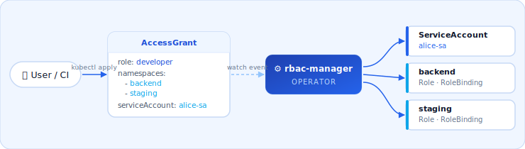
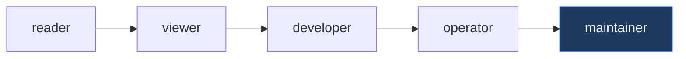

<div align="center">


<br/><br/>

[](https://github.com/xbrekz1/rbac-manager/actions/workflows/ci.yml)
[](https://github.com/xbrekz1/rbac-manager/actions/workflows/release.yml)
[](https://goreportcard.com/report/github.com/xbrekz1/rbac-manager)
[](LICENSE)

**One resource instead of seven.**

</div>

---

```yaml
apiVersion: rbacmanager.io/v1alpha1
kind: AccessGrant
metadata:
  name: alice
  namespace: rbac-manager
spec:
  role: developer
  namespaces:
    - backend
    - staging
  serviceAccountName: alice-sa
```

```
$ kubectl get accessgrants -n rbac-manager
NAME    ROLE       SERVICEACCOUNT   NAMESPACES           PHASE    AGE
alice   developer  alice-sa         [backend staging]    Active   3s
```

rbac-manager created the ServiceAccount, a Role in each namespace, and bound them together. Delete the `AccessGrant` — everything is removed.

---

## ⚙️ How it works



Resources are created instantly on `AccessGrant` apply and cleaned up automatically on delete via Kubernetes finalizers — even if the operator was temporarily down during deletion.

---

## 🛡️ Roles



| Role | Logs | Exec | Secrets | Write | Use case |
|------|:----:|:----:|:-------:|:-----:|----------|
| `reader` | — | — | — | — | Stakeholders, dashboards |
| `viewer` | ✓ | — | — | — | Monitoring, on-call |
| `developer` | ✓ | ✓ | read | — | Developers, QA |
| `deployer` | ✓ | — | — | ✓ | CI/CD pipelines |
| `debugger` | ✓ | ✓ | — | — | Incident response |
| `operator` | ✓ | ✓ | read | ✓ | SRE teams |
| `auditor` | ✓ | — | read | — | Security reviews |
| `maintainer` | ✓ | ✓ | ✓ | ✓ | Tech leads |
| `cluster-admin` | ✓ | ✓ | ✓ | ✓ | Full cluster — use with `clusterWide: true` |

Need something custom? Use [RoleTemplate](#roletemplate).

---

## ⚡ Install

```bash
helm install rbac-manager oci://ghcr.io/xbrekz1/charts/rbac-manager \
  --namespace rbac-manager --create-namespace
```

**Requirements:** Kubernetes 1.28+, Helm 3.x

> **Production** — enable the validating webhook for admission-time validation.
> Requires [cert-manager](https://cert-manager.io) for TLS:
> ```bash
> helm install rbac-manager oci://ghcr.io/xbrekz1/charts/rbac-manager \
>   --namespace rbac-manager --create-namespace \
>   --set webhook.enabled=true \
>   --set webhook.certManager.enabled=true
> ```

---

## 📖 Usage

### Namespace access

```yaml
spec:
  role: developer
  namespaces:
    - backend
    - staging
  serviceAccountName: alice-sa
```

### Cluster-wide access

```yaml
spec:
  role: cluster-admin
  clusterWide: true
  serviceAccountName: platform-bot
```

### RoleTemplate

Define rules once — changes propagate to all referencing `AccessGrant`s automatically.

First, apply the template to the cluster:

```bash
kubectl apply -f role-templates/developer-extended.yaml
```

Then reference it in `AccessGrant`:

```yaml
spec:
  roleTemplate: developer-extended
  namespaces:
    - backend
  serviceAccountName: alice-sa
```

Ready-made templates for common patterns are in [`role-templates/`](role-templates/).

---

[Makefile](Makefile) for all dev commands &nbsp;·&nbsp; [MIT License](LICENSE)
